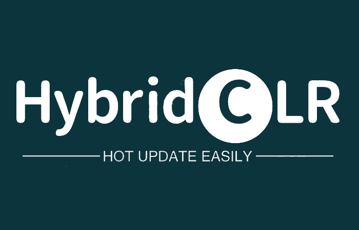
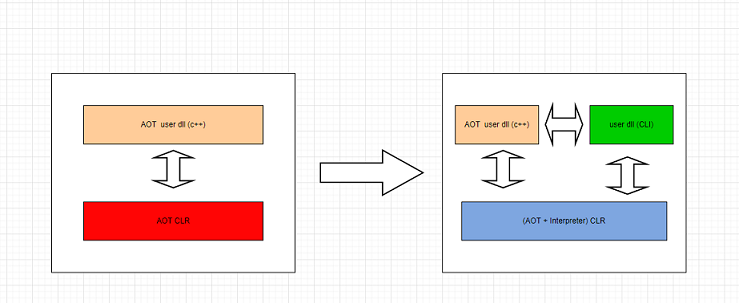

- [README 中文](./README.md)
- [README English](./README_EN.md)

# HybridCLR

 
 

HybridCLR is a nearly perfect Unity full-platform native c# hot update solution with complete features, zero cost, high performance, and low memory.

HybridCLR expands the il2cpp runtime code, changing it from a pure [AOT](https://en.wikipedia.org/wiki/Ahead-of-time_compilation) runtime to an AOT+Interpreter hybrid runtime, and then natively supports dynamic loading of assemblies. Hot updates are fully supported from the bottom up. Games using HybridCLR technology can run efficiently not only on the Android platform, but also on IOS, Consoles, WebGL and other platforms supported by il2cpp.

Due to HybridCLR's good support for the ECMA-335 specification and its high compatibility with the Unity development workflow, the Unity project can almost seamlessly obtain the ability to hot update C# code after accessing HybridCLR. Developers do not need to change their daily development habits and Require. For the first time, HybridCLR has reduced the engineering difficulty of the Unity platform's full-platform code hot update solution to almost zero.

Welcome to embrace modern native C# hot update technology! ! !

## Documents

- [Official Document](https://hybridclr.doc.code-philosophy.com/docs/intro)
- [Quick Start](https://hybridclr.doc.code-philosophy.com/docs/beginner/quickstart)
- [Business Project Case](https://hybridclr.doc.code-philosophy.com/docs/other/businesscase)

## Features

- A nearly complete implementation of the [ECMA-335 specification](https://www.ecma-international.org/publications-and-standards/standards/ecma-335/), with only a very small number of [unsupported features](https ://hybridclr.doc.code-philosophy.com/docs/basic/notsupportedfeatures).
- Zero learning and usage costs. For most developers, there are almost no limits to writing code.  Hot update code works seamlessly with AOT code, and you can write code such as inheritance, **generics**, and **reflection** at will. No need to write any additional special code, no code generation
- Fully supports multi-threading, including but not limited to volatile, ThreadStatic, async Task and other related functions and features. This is not supported by any other hot update solution
- Almost fully compatible with Unity workflow. Including but not limited to supporting hot update **MonoBehaviour**, ScriptableObject, **DOTS** technology, the hot update script mounted on the resource can be instantiated correctly, which is not supported by all other hot update solutions.
- Efficient execution. An extremely efficient register interpreter is implemented, and all indicators are significantly better than other hot update schemes. [Performance test report](https://hybridclr.doc.code-philosophy.com/docs/basic/performance)
- Memory efficient.  The classes defined in the hot update script occupy the same memory space as ordinary C# classes, which is far superior to other hot update solutions. [Memory Usage Report](https://hybridclr.doc.code-philosophy.com/docs/basic/memory)
- Supports MonoPInvokeCallback, which can interact well with native code or other languages such as lua, javascript, and python
- Supports some features not supported by il2cpp, such as __makeref, __reftype, and __refvalue instructions
- Supports the original **Differential Hybrid Execution (DHE)** differential hybrid execution technology, that is, the AOT dll can be added, deleted or modified at will, and the unmodified functions will be intelligently run in AOT mode, and the changed or added functions will be run in interpreter mode. Run, so that the running performance of the hot updated game logic can basically reach the level of native AOT.
- Supports **Hot Reload** technology, which can 100% uninstall the assembly
- Supports modern dll encryption technology to effectively ensure code security

## Supported Unity Versions And Platforms

- Supports 2019.4.x, 2020.3.x, 2021.3.x, 2022.3.x, 2023.2.x、**6000.x.y** versions
- Supports all il2cpp supported platforms
- Supports Tuanjie Engine and Harmony Platform

## Working Principle

HybridCLR is inspired by mono's [mixed mode execution](https://www.mono-project.com/news/2017/11/13/mono-interpreter/) technology and provides additional AOT runtimes such as unity's il2cpp Interpreter modules are provided to transform them from pure AOT runtime to "AOT + Interpreter" hybrid runtime.

More specifically, HybridCLR does the following:

- Implemented an efficient metadata (dll) parsing library
- The metadata management module has been transformed to realize dynamic registration of metadata.
- Implemented a compiler from IL instruction set to custom register instruction set
- Implemented an efficient register interpreter
- Provides a large number of additional instinct functions to improve interpreter performance

## Stability Status

HybridCLR has been widely proven to be a very efficient and stable Unity hot update solution.

Currently, the **extremely stable** official versions of 1.x-5.x have been released, which are sufficient to meet the stability requirements of large and medium-sized commercial projects.
Currently, thousands of commercial game projects have been connected, and hundreds of them have been launched on both ends. The online projects include MMORPG, heavy card, heavy tower defense and other games. **The vast majority of leading game companies** (such as Tencent and NetEase) are already using HybridCLR.

You can view the [list of projects] (https://hybridclr.doc.code-philosophy.com/docs/other/businesscase) that use HybridCLR and have been launched in leading companies we know.

## Support & Contact

- Official group 1: 651188171 (full)
- Novice group 1: 428404198 (full)
- Newbie Group 2: **680274677 (recommended)**
- discord channel https://discord.gg/BATfNfJnm2
- Business cooperation email: business#code-philosophy.com
- [Business support](https://hybridclr.doc.code-philosophy.com/docs/business/intro)

## About Author

**walon**: **Code Philosophy** founder

Graduated from the Physics Department of Tsinghua University, won the CMO gold medal in 2006, was a member of the National Mathematical Olympiad training team, and was recommended to Tsinghua Basic Science Class. Focus on game technology, good at developing architecture and basic technical facilities.

## License

HybridCLR is licensed under the [MIT](https://github.com/focus-creative-games/hybridclr/blob/main/LICENSE) license