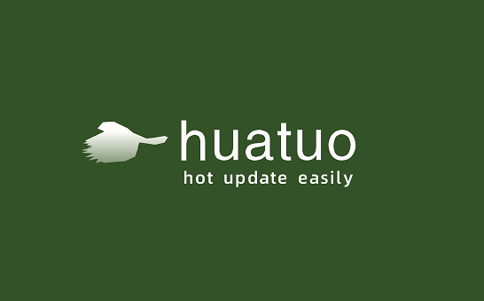

#huatuo

 

 

Huatuo is a near-perfect C# hot update solution with complete features, zero cost, high performance, and low memory.

huatuo provides interpreter modules for pure AOT CLRs such as il2cpp, so that apps based on them can efficiently use the **AOT+interpreter** hybrid mode not only on the Android platform, but also on IOS, Consoles and other platforms that limit JIT. Execute, from the bottom to fully support the hot update.

## Features

- Features complete. Nearly complete implementation of the [ECMA-335 specification](https://www.ecma-international.org/publications-and-standards/standards/ecma-335/), except for the features below "Limitations and Notes" are supported.
- Zero learning and usage costs. huatuo enhances the pure AOT runtime into a full CLR runtime, making hot update code work seamlessly with AOT code. Script classes are in the same runtime as AOT classes, even code like reflection, multi-threading (volatile, ThreadStatic, Task, async) works fine. There is no need to write any special code, no code generation, and no special restrictions.
- Execute efficiently. Implemented an extremely efficient register interpreter that outperformed other hot update schemes by a large margin by all metrics. [Performance test report](docs/benchmark.md)
- Memory efficient. The classes defined in the hot update script occupy the same memory space as ordinary C# classes, which is far superior to other hot update solutions. [Memory usage report](docs/memory.md)
- Native support for hotfix to repair part of AOT code. Adds almost no development and runtime overhead.

## working principle

Inspired by mono's [Hybrid mode execution](https://developpaper.com/new-net-interpreter-mono-has-arrived/) technology, huatuo provides additional interpreter modules for AOT runtimes such as unity's il2cpp , transforming them from pure AOT runtime to "AOT + Interpreter" hybrid operation mode, which completely supports hot update from the bottom.

More specifically, huatuo does the following:

- Implemented an efficient metadata (dll) parsing library
- Modified the metadata management module of il2cpp to realize the dynamic registration of metadata
- Implemented a compiler from an IL instruction set to a custom register instruction set
- Implemented an efficient register interpreter
- Provide a large number of instinct functions additionally to improve the performance of the interpreter
- Provide hotfix AOT support (in progress)

## Documentation

- [wiki](docs/home.md)
- [Quick Start](docs/start_up.md)
- [FAQ](docs/FAQ.md)
- [Common Errors](docs/common_errors.md)
- [Best Practices](docs/best_practices.md)
- [Source Structure and Trace Debugging](docs/source_inspect.md)
- [Sample Project](https://github.com/focus-creative-games/huatuo_trial)
- [Know the column] (https://www.zhihu.com/column/c_1489549396035870720)
- [==>Acknowledgments<==](docs/donate.md)
- Support and Contact
  - QQ group: 651188171 (huatuo c# hot update development exchange group)
  - Email: taojingjian#gmail.com

## Stability status

In terms of technical evaluation, the current stability is between the Alpha version and the Beta version.

- Completed unit tests for most instructions. Only a few instructions such as calli and initblk that are difficult to construct directly in C# do not have corresponding unit tests added.
- Completing various syntax tests against the c# specification.
- Tested the compatibility of common game libraries and frameworks, and the compatibility is good. See [Compatibility Report](docs/compatible.md)
- [luban](https://github.com/focus-creative-games/luban) config can be loaded correctly
- Can correctly run lightweight games like [2048](https://github.com/dgkanatsios/2048)
- Can run small games like [StarForce](https://github.com/EllanJiang/StarForce)
- Helping some small, medium and large (there is a heavy MMORPG project) to migrate and test huatuo. It is expected that large-scale game projects such as MMORPG can be successfully run this month.

## Limitations and Notes

**Features not included in the restrictions are all supported by huatuo**. Please stop asking if huatuo supports a certain feature.

- Support 5.x, 2017-2022 full series of versions, but not every minor version. For details, see [Currently Supported Unity Versions](docs/support_versions.md).
- Unable to create instances of **hot update non-enumeration value types** of ordinary AOT generics (**delegate, Nullable, arrays (including multi-dimensional) are not limited, hot update generics are also completely unlimited**) instance of the type. For example, List&lt;HotUpdateValueType&gt; is not supported but List&lt;int&gt;, List&lt;HotUpdateClass&gt; and List&lt;HotUpdateEnum&gt; are supported. For specific reasons, see [AOT generic limitation and principle introduction](docs/generic_limit.md). This will be more completely resolved in the July version, and there will be no restrictions after that.
- The default async task that returns **custom value type** is temporarily not supported, and native value types such as int and enumeration and class types are not restricted. The reason is that the compiler will generate the generic class instantiation of AsyncTaskMethodBuilder&lt;T&gt; for async by default. If you use custom Task and AsyncTaskMethodBuilder like ETask, there are no restrictions. This limitation of native async will be resolved in subsequent versions.
- **Note to use link.xml or code reference to avoid Unity cutting code. Avoid the error that the function can be called during the development period, but the function cannot be found after the release. We will provide default templates in the future.
- BeginInvoke and EndInvoke of delegate are not supported. It just doesn't feel necessary to do it.
- Due to the limitation of Unity's resource management mechanism (the script uuid has been determined during packaging, and the GUID corresponding to the hot update script cannot be found), the hot update MonoBehaviour needs to be compiled into an independent dll and mounted on the resource to be correctly reversed change
- Incremental gc is not supported yet. Due to the tight time, it is too late to carefully deal with the memory barrier details of incremental gc. This issue will be resolved soon.
- Temporarily does not support C# source code debugging of the real machine after packaging, but can print the error stack (only accurate to the function), and can also track and debug in the Debug project generated by Build. You can use the usual mono debugging for debugging during the development period under the Editor.

## RoadMap

Although huatuo is related to il2cpp, most of the core code is independent of il2cpp and can be easily ported (expected one month) to other CLR platforms that do not support AOT+Interpreter. No matter how the version of Unity changes, even if il2cpp is abandoned and .net 6+ is used, huatuo will continue to follow up and stably provide cross-platform CLR hot update service until one day when .net officially supports AOT+Interpreter, huatuo will complete its historical mission.

- Continue to fix bugs to make a medium and large game work properly (2022.4)
- Continue to follow up the version update of Unity and support more Unity versions. See [Currently Supported Unity Versions](docs/support_versions.md)
- Support hotfix bug in AOT part (2022.6)
- Remove most common AOT generic class restrictions (2022.6)
- Support incremental gc. (2022.6)
- Instruction optimization, the number of instructions after compilation is reduced to 1/4-1/2, and the performance of basic instructions and most object model instructions is improved by 100%-300%. (2022.6 preview version)
- Support for extern functions (2022.7)
- Other memory and efficiency optimizations, and code refactoring
- **===godot engine support ===**(2022.12)

## license

Huatuo is licensed under the [MIT](https://github.com/focus-creative-games/luban/blob/main/LICENSE.TXT) license